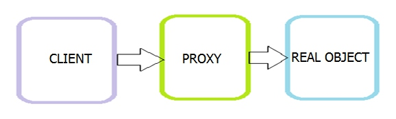
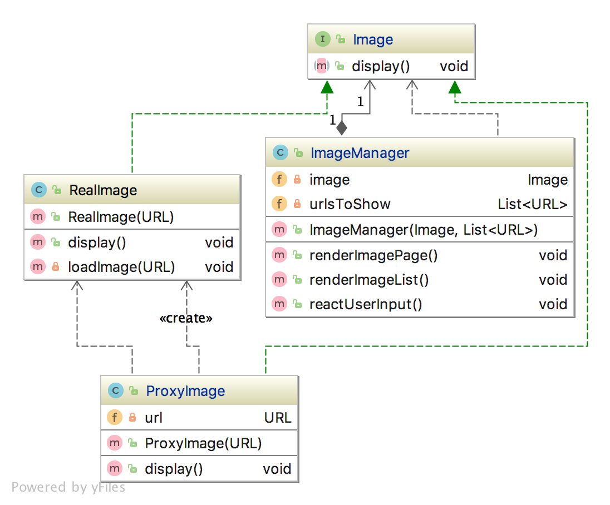

## Паттерн Proxy

**Прокси** - это некоторый промежуточный объект, дублирующий функциональность реального объекта, и ограничивающий доступ к этому объекту.
 

 
**Применение:**
* Есть ресурсоемкий объект, который нужен только в определнный момент времени (например, для скачивания видео или отображения каритнок). В остальное время хранить его в памяти накладно, вместо этого можно использовать прокси, который создаст нужный объект в нужный момент времени.

**Реализация:**

